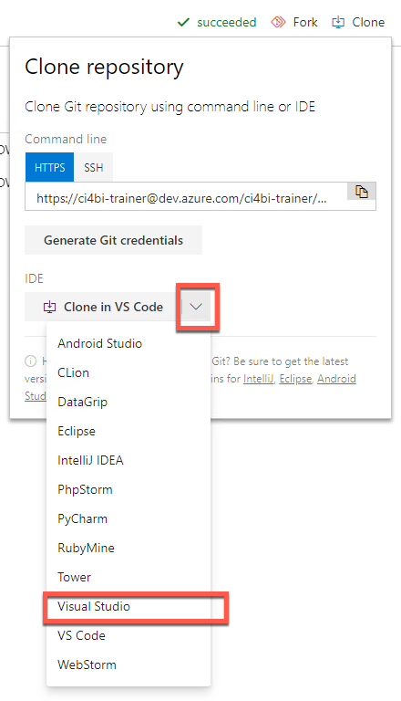
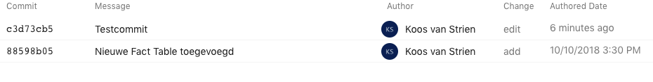
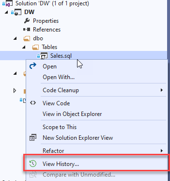

# Azure Repos lab

Met de kennis over Git in het achterhoofd werken we nu vanuit de grafische schil van Visual Studio.

## Koppelen van Azure DevOps

Onderstaande stappen voer je uit op de "dev" machine (dit is de virtuele BITrainer-machine).

1. Log in op GitHub op [https://www.github.com/BITrainer-nl/git-github-workshop](https://www.github.com/BITrainer-nl/git-github-workshop)
2. Klik op "Clone" (rechtsboven)
   * 

**TODO Uitleg over clone**

_Bedenk dat NTFS een beperkte padlengte heeft - dit kan bij grotere projecten nog weleens uitdagingen geven. Kies daarom bij voorkeur een pad dat niet te diep ligt!_

Je ziet nu in het Visual Studio-venster de "Folder View" van de Solution Explorer. Kijk hier gerust even rond om te zien wat er in de repository zit.

## Doorvoeren van wijzigingen

Onderstaande stappen voer je uit op de "dev" machine. Het kan handig zijn om hiervoor te schakelen naar de *Team Explorer*-weergave in plaats van de *Folder View*.

### Break the build

1. Open DW.sln
2. Open de tabeldefinitie voor `Sales.sql`
3. Verwijder regel 10 (hier staat de tekst `);`)
   Als het goed is, verschijnen er nu diverse rode blokjes en kringeltjes om aan te geven dat er iets mis is. Dit is precies de bedoeling: ten slotte willen we dat de build juist niet meer lukt!
4. Sla het bestand op, en open de **Team Explorer**
5. Bekijk de wijzigingen via **Changes**
   * Wanneer je de knop *Changes* mist in Team Explorer, ga dan eerst terug naar **Home** via het "huisje" bovenin.
6. Wanneer de Git User Information gevraagd wordt, vul je hoe je geïdentificeerd wilt worden in de commit logs. Dit heeft geen impact op logins of authenticatie.
7. Rechtsklik onder het kopje **Changes** op **Sales.sql** en klik **Stage**
   * Sales.sql staat nu niet meer onder het kopje *Changes*, maar onder *Staged Changes*
   * Wat zou er achterliggend in Git gebeurd zijn?
8. Voer een commit message in, en klik op "Commit Staged"
   * Met de "commit" heb je de nieuwe code weliswaar in je lokale repository opgeslagen, maar nog niet naar de "blessed repo" gepusht.
   * In Visual Studio wordt dit een "Sync" genoemd: pull, daarna push.
   * (Feitelijk veroorzaakt elke *sync* dus drie Git-acties: *fetch - merge - push*)
9. Zorg ervoor dat de commit die je zojuist gedaan hebt ook op de server belandt.
10. Verifieer in de *Azure DevOps Portal* dat je wijziging daadwerkelijk doorkomt. Dit kun je doen door in het juiste project naar *Repos* te gaan, en te kijken hoe het bestand *Sales.sql* eruit ziet.
11. Bekijk ook het tabje "History". Als het goed is, zie je hier de commit die je zojuist gedaan hebt terug.

### The build is broken

De verwachting is dat onze "commit" een gebroken build heeft opgeleverd. Open de Azure DevOps portal en kijk of je dit daadwerkelijk kunt terugvinden.

_Hieronder staat een uitgewerkt stappenplan, maar wellicht vind je er meer uitdaging in om zelf uit te zoeken waar je de build pipeline kunt vinden_

1. Open de *Azure DevOps portal*
2. Navigeer naar het juiste *project*
3. Open *Pipelines*
4. Ongeacht of de build al voltooid is, klik op de naam van de commit
   * Als de build al voltooid is zie je hier alle resultaten
   * Als de build nog bezig is, zie je de resultaten hier live binnenkomen
5. Wacht tot de build voltooid is, en bekijk de resultaten:
   * Welke stap is er foutgegaan?
   * Kun je de foutmeldingen plaatsen?
   * Welke stappen zijn er vervolgens overgeslagen? Waarom?
   * Welke stappen zijn er goed gegaan? Vind je dit logisch?

#### Overgeslagen stappen

Omdat de build niet succesvol kan afronden, heeft de build agent ook geen *artifact* (= het resultaat van een build). Daarom zijn de volgende stappen ook overgeslagen:

* Copy build artifacts
* Publish Artifact

Omdat er geen artifact wordt klaargezet, kan er ook geen trigger voor een deployment afgaan. Pas bij een netjes voltooide build zal er een deployment-proces in werking gezet kunnen worden.

### Fix the build

De eenvoudigste manier om de build te corrigeren is momenteel om een "rollback" te doen van bepaalde wijzigingen.

1. Open de solution *DW.sln*
2. In de *Solution Explorer*, open de map *dbo* -> *Tables*
3. Rechtsklik op *Sales.sql*, kies *View History...*
   * 
   * Het venster "History - Sales.sql" opent zich. Dubbelklik hier op een versie om te bekijken hoe een bestand er bij een bepaalde commit uitzag.
4. Rechtsklik op de meest recente commit (dit is de commit waar de fout voor het eerst is opgetreden) en klik **revert**.  
   Wanneer je het venster "History - Sales.sql" ververst (knop linksboven), zie je deze nieuwe commit ook verschijnen in de lijst met commits.
5. Synchroniseer de nieuwe lijst met commits richting de *blessed repo*, en verifieer dat de build nu weer correct verloopt.

#### Revert vs. checkout

We hebben hier zojuist een *revert* uitgevoerd. Dit is een eenvoudige en heldere actie, die alle wijzigingen binnen een commit ongedaan maakt in een nieuwe commit. Wanneer je slechts enkele wijziging wilt terugzetten, kun je ook gebruikmaken van een `checkout` van een specifieke versie van een bestand. Deze optie is helaas niet binnen de GUI van Visual Studio aanwezig:

1. Pas het bestand `Sales.sql` opnieuw aan, verwijder regel 10
2. Zet op regel 10 nu de tekst `/* ONGEWENSTE WIJZIGING */`
3. Pas nu ook het bestand `SalesViaSSIS.sql` aan. Voeg hier op regel 2 de tekst `/*GEWENSTE WIJZIGING*/` in.
4. Sla de bestanden op, en zorg voor een commit. *Doe hier geen sync, we voeren dit buiten de blessed repo uit*
5. Rechtsklik op *Sales.sql*, kies *View History...*
6. Open **Git Bash** of **Git cmd**, en navigeer naar de map waar je repository staat (bijv. `C:\Users\cursist\source\repos\03-introducing-git-azure-repos`). Hier kun je de volgende commando's voor gebruiken:

|                                               | Bash         | Cmd          |
|-----------------------------------------------|--------------|--------------|
| Huidige map weergeven                         | pwd          | cd           |
| Veranderen van map                            | cd (mapnaam) | cd (mapnaam) |
| Scheidingsteken tussen parent- en childmappen | /            | \            |
| Inhoud van een map weergeven                  | ls           | dir          |

7. Geef het commando `git log -3`. Dit geeft je een lijst met de drie laatste wijzigingen.
8. Noteer de eerste zes tekens van de hash van de meest recente (bovenste) commit (bijv. `bb371d`)
9. Haal nu één bestand terug uit een andere *commit*. Dit kan met het commando `git checkout`.
   * Dit ziet er bijvoorbeeld als volgt uit (let op: Git is case sensitive!)  
   `git checkout bb371d~ src\sqldatabase\DW\DW\dbo\Tables\Sales.sql` (voor cmd)  
   `git checkout bb371d~ src/sqldatabase/DW/DW/dbo/Tables/Sales.sql` (voor bash)  
      * De **zes tekens (`bb371d`)** identificeren hier de commit
      * De **tilde (`~`)** geeft aan dat we een checkout willen doen van de versie vóór de commit die hier aangegeven is (dus in dit geval de commit voorafgaand aan bb371d)
      * Het **pad (src/.../.sql)** geeft aan welk bestand we uit die commit willen ophalen
10. Voer `git status` uit. 
    * Waar is het zojuist opgehaalde bestand terecht gekomen? In je working directory, je staging index of is het al opgenomen in een commit?
11. Open Visual Studio, en controleer of de bestanden `Sales.sql` en `SalesViaSSIS.sql` nu correct zijn
    * De ongewenste wijziging van `Sales.sql` moet verdwenen zijn
    * De gewenste wijziging van `SalesViaSSIS.sql` moet nog aanwezig zijn
12. Zorg ervoor dat deze gecorrigeerde aanpassing naar Azure DevOps gebracht wordt. Je kunt dit naar keuze vanaf de commandline doen, of binnen Visual Studio.

Je kunt in Visual Studio wel één enkel bestand uit een andere commit halen, maar de vraag is of dit veel eenvoudiger is dan via de command-line. Een beschrijving ervan is te vinden op [https://stackoverflow.com/questions/38599554/how-do-you-get-a-specific-version-from-git-in-visual-studio-2015](https://stackoverflow.com/questions/38599554/how-do-you-get-a-specific-version-from-git-in-visual-studio-2015)

# Welke Git-commando's zijn er eigenlijk?

Hoewel je Git goed kunt gebruiken binnen Visual Studio, loop je vroeg of laat tegen de beperkingen van de grafische interfaces aan en heb je de command-line nodig. Dat ziet er even anders uit dan de Visual Studio-omgeving die je gewend bent, maar is vaak verrassend gebruiksvriendelijk: als je de basis van Git snapt en de berichten leest, word je vaak bij de hand genomen wat er moet gebeuren. Hieronder zie je een aantal voorbeelden:

## Push

Je hebt (volgens de meest recente informatie van Git) één commit lokaal staan die nog niet op de remote repository bekend is. Je krijgt de tip om `git push` te gebruiken om deze te publiceren.

## Push / reset

* Je hebt 17 commits lokaal staan, die niet bij de remote repository bekend zijn. Een `git push` publiceert jouw nieuwe commits
* Je hebt drie wijzigingen in je *staging index* staan die nog niet *committed* zijn. Als je deze weer uit de staging wilt halen kan dit met `git reset HEAD <bestandsnaam>`

## Add / Checkout

Er zijn twee bestanden gewijzigd die nog niet staged zijn.

* Je kunt deze bestanden toevoegen met `git add`
* Je kunt de wijzigingen ongedaan maken met `git checkout --` (in dat geval ben je dus je lokale wijzigingen kwijt!

Daarnaast ziet Git één bestand wat nog niet in versiebeheer is opgenomen (`azure-pipelines.yml`). Je kunt deze toevoegen met `git add`

Ten slotte ziet Git dat er momenteel niets in staging staat, en geeft je een hint hoe je bestanden kunt toevoegen voor een commit (`git add` of `git commit -a`)

## Cheatsheet en kort overzicht van commando's

Er zijn twee veelgebruikte Git cheatsheets waarin je alle commando's ziet staan:

* [Een (printbare) PDF van GitHub](https://github.github.com/training-kit/downloads/github-git-cheat-sheet.pdf)
* [Een interactieve website, opgebouwd vanuit de diverse "tiers" van Git](http://ndpsoftware.com/git-cheatsheet.html)

Op de website van Git ook een [uitgebreid overzicht van beschikbare commando's](https://git-scm.com/docs)

| Command  | Meaning                                       |
|----------|-----------------------------------------------|
| init     | Initialize new repository                     |
| clone    | Clone a repository into a new directory       |
| add      | Add new files from working tree to snapshot   |
| status   | Show the working tree status                  |
| commit   | Record changes in the repository              |
| rm       | Remove files from working tree and from index |
| mv       | Move or rename a file                         |
| branch   | List, create or delete branches               |
| checkout | Switch branches                               |
| merge    | Join two or more branches                     |
| fetch    | Download from another repository              |
| pull     | fetch + merge                                 |
| push     | Upload to another repository                  |
| remote   | Manage set of tracked repositories            |
