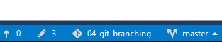

# Lab: Git Branching in Visual Studio

De ervaring van branching binnen Git brengen we in dit lab naar Visual Studio. We werken hier binnen een project waarin de `master` branch als *collaboration branch* is aangewezen. Hier wordt dus de code samengebracht en geïntegreerd die in de diverse *feature branches* is ontwikkeld. Later zullen we zien dat deze werkwijze niet alleen gebruikelijk is, maar zelfs min of meer noodzakelijk wanneer je de builds en releases van Azure Data Factory wilt automatiseren.

Wanneer er nieuwe commits binnenkomen op de *master* branch, wordt er hier automatisch een deployment getriggerd richting de test-omgeving. In een real-world scenario zitten hier vaak nog release-branches aan vast, die alleen gevoed kunnen worden door *master*.

## Stappenplan

### Ophalen van huidig project

1. Open Visual Studio / SQL Server Data Tools
2. Open de Team Explorer
3. Klik op "Manage connections" (de "groene stekker")  
   
4. Klik (indien nodig) opnieuw op "Manage connections" (de blauwe tekst)  
   
5. Klik Add an account...
6. Log in met je @BITrainer.nl-account
7. Selecteer
   * dev.azure.com
   * je eigen organization (bijv. "ci4bi-kvs")
   * project **04-git-branching**
   * repository **04-git-branching**
8. Selecteer het pad waar je deze code wilt neerzetten, en klik "Clone"  
   
9. Open **AdventureWorksDW.sln** en bekijk de oplossing

### Doorvoeren van wijzigingen

De standaard-branch die altijd in Git wordt aangemaakt (`master`), is ook hier de standaard-branch. Het idee hierachter is dat dit de centrale plek is, waarin de stabiele versies van alle ontwikkelingen samenkomen (dit wordt vaak de *collaboration branch* genoemd). Wanneer je de code dan met een *clone* ophaalt uit de Git repository, kijk je automatisch naar de meest recente stabiele versie. In Visual Studio zie je rechtsonder ook altijd in welke repository en branch je momenteel aan het werk bent.



> We gaan enkele wijzigingen aanbrengen in dit project. Naast de internetverkopen (opgevangen in `FactInternetSales`) en de reseller-verkopen (opgevangen in `FactResellerSales`) wil het management meer zicht krijgen op de verkopen aan eigen medewerkers. Vanuit het BI-team is daarom besloten een nieuwe Fact daarvoor op te zetten: `FactEmployeeSales`.

Open `AdventureWorksDW.sln` en neem daarin de volgende stappen:

1. Open *dbo* -> *Tables*
2. Rechtsklik, en voeg een nieuwe tabel toe. Geef deze de naam `FactEmployeeSales` en gebruik de volgende definitie:  

```sql
CREATE TABLE [dbo].[FactEmployeeSales] (
    [ProductKey]            INT           NOT NULL,
    [OrderDateKey]          INT           NOT NULL,
    [DueDateKey]            INT           NOT NULL,
    [ShipDateKey]           INT           NOT NULL,
    [EmployeeKey]           INT           NOT NULL,
    [CurrencyKey]           INT           NOT NULL,
    [SalesOrderNumber]      NVARCHAR (20) NOT NULL,
    [SalesOrderLineNumber]  TINYINT       NOT NULL,
    [RevisionNumber]        TINYINT       NOT NULL,
    [OrderQuantity]         SMALLINT      NOT NULL,
    [UnitPrice]             MONEY         NOT NULL,
    [ExtendedAmount]        MONEY         NOT NULL,
    [UnitPriceDiscountPct]  FLOAT (53)    NOT NULL,
    [EmployeeDiscountPct]   FLOAT (53)    NOT NULL,
    [DiscountAmount]        FLOAT (53)    NOT NULL,
    [ProductStandardCost]   MONEY         NOT NULL,
    [TotalProductCost]      MONEY         NOT NULL,
    [SalesAmount]           MONEY         NOT NULL,
    [TaxAmt]                MONEY         NOT NULL,
    [Freight]               MONEY         NOT NULL,
    [CarrierTrackingNumber] NVARCHAR (25) NULL
);

```

3. **Save All**
4. Ga naar **Team Explorer**
5. Open **Changes**
6. Voer een *commit* door voor de bovenstaande wijziging.


We hebben nu een wijziging gemaakt in onze **lokale** branch `master`. Om deze naar onze *blessed repo* op Azure DevOps te brengen, moeten we nog een *push* doen. Dit blijkt echter niet te mogen:

7. Probeer de wijzigingen te synchroniseren naar Azure DevOps.

Je krijgt waarschijnlijk de volgende foutmelding:

> Failed to push to the remote repository. See the Output Window for more details.

Wanneer je vervolgens naar het Output-venster kijkt (let op dat je "Show output from:" op `Source Control - Git` staat ingesteld), dan zie je een tekst met min of meer de volgende strekking:

```
Remote: Azure Repos
Remote:
Remote: Found 50 objects to send. (71 ms)
Opening repositories:
C:\Users\trainer\Source\Repos\04-git-branching
Commit 73b5c90a created locally in repository C:\Users\trainer\Source\Repos\04-git-branching
Remote:
Remote: Analyzing objects... (9/9) (11 ms)
Remote: Storing packfile... done (185 ms)
Remote: Storing index... done (97 ms)
Error: failed to push some refs to 'https://ci4bi-cloud@dev.azure.com/ci4bi-cloud/04-git-branching/_git/04-git-branching'

Error encountered while pushing to the remote repository: rejected master -> master (TF402455: Pushes to this branch are not permitted; you must use a pull request to update this branch.)
```

## Feature branches

Het feit dat deze branch stabiel moet zijn, maakt het onwenselijk dat iedereen de tussentijdse commits hierheen *pusht*. Daarom zijn hier in dit voorbeeldproject blokkades voor opgezet.

De gedachte hierachter is dat wijzigingen overal mogen plaats vinden, behalve in de `master`-branch (en eventuele release branches, die alleen "gevoed" worden vanuit `master`). Dit is in Azure DevOps in te stellen via een **branch policy**, die je op de volgende plek kunt terugvinden in de Azure DevOps portal:


De specifieke Merge Policy die een directe **push** richting een branch blokkeert, is **Limit merge types - Basic merge (no fast-forward)**.

### Wijzigingen onderbrengen in een andere branch

Wanneer we de commit-log zouden opvragen, zou deze er min of meer als volgt uitzien:


* De lokale HEAD (dus de commit waarmee de working directory vergeleken wordt) staat op de commit met een nieuwe fact-table
* `origin/HEAD` (dus de commit waarnaar Azure DevOps kijkt) staat één commit eerder

Om nu mijn wijzigingen door te kunnen voeren binnen Azure gaan we de volgende drie stappen doen:

* We maken een branch aan vanaf `master`
  * Initieel staat hier exact hetzelfde als in `master`
  * Dit wordt onze **feature branch**, waarin we de *feature* van de nieuwe fact table ontwikkelen
* We maken de wijzigingen binnen `master` ongedaan, door een *reset* van de lokale `master` op basis van `origin/master`
* We doen een *push* van de nieuwe *feature branch*

Nadat de ontwikkelingen op de *feature branch* voltooid zijn, zullen we deze vervolgens samenvoegen met de `master` branch. Dit doen we met behulp van een zogenaamd **pull request**.

#### Aanmaken nieuwe branch

1. Open **Team Explorer**
2. Klik **Branches** (*als je deze niet kunt vinden: klik eerst op het "Home" icoontje*)
3. Klik **New Branch**
4. Geef deze de naam **feature-fact-employeesales**
5. Klik **Create Branch**


Merk op dat het vinkje **Checkout branch** standaard aan staat: dit betekent dat we dus niet alleen een branch *aanmaken*, maar ook direct hierin gaan werken.

#### Wijzigingen ongedaan maken in master

We werken momenteel in de branch **feature-fact-employeesales**, maar willen de wijzigingen ongedaan maken op onze lokale **master** branch. Daarom schakelen we eerst terug naar **master**, en maken daarna de lokale wijzigingen ongedaan.

6. Schakel terug naar de **master** branch. Dit kan het makkelijkst via het **branch** menu, linksonder in Visual Studio:  

7. Open het mapje **remotes/origin**
8. Rechtsklik **master** onder **remotes/origin**
9. Klik **Reset** -> **Delete Changes**

Feitelijk zeg je hier dat je je **lokale** *master*-branch weer gelijk wilt zetten aan de **remote** *master*-branch (dus die op Azure DevOps). Daarom klik je op **master** onder **remotes/origin** (en niet je lokale **master**).


De lokale branch **master** heeft nu geen wijzigingen meer ten opzichte van *master* op Azure DevOps.

10. Schakel via het menu rechtsonderin heen en weer tussen de branch `master` en de branch `feature-fact-employeesales`.
    * Verifieer op dat de tabel FactEmployeeSales nu niet meer zichtbaar is in `master`, maar nog wel "gewoon" in de nieuwe *feature branch*.


#### Push van de nieuwe branch naar Azure DevOps

De branch `feature-fact-employeesales` bestaat nu alleen nog lokaal. Om deze naar Azure DevOps te brengen, moeten we nog een **push** doen. Zorg er bij de volgende stappen voor dat je op de zojuist aangemaakte *feature branch* aan het werk bent!

11. Open **Team Explorer**
12. Ga naar **Sync**
13. Bekijk het kopje "Outgoing Commits" goed, en klik daarna **Push**

> Bij de **push** van zojuist stond de volgende tekst:
>
> De achterliggende reden is dat een "normale" push gebruikmaakt van opgeslagen kennis over welke branch er op de *remote* correspondeert met de branch die je nu bewerkt.
> Die kennis is er nu niet: je hebt namelijk de branch zojuist lokaal aangemaakt (er is dus ook geen corresponderende *remote* branch).
>
> Wanneer je dit vanaf een Git Bash of Git CMD zou doen, gebruik je plaats van een "simpele" `git push` in dat geval `git push --set-upstream origin mijnnieuwebranch`.
>
> Voor ons is dit nu echter geen probleem: Visual Studio neemt deze achterliggende extra stap voor zijn rekening, en brengt ons met een korte melding op de hoogte.

### Hotfix!

De ontwikkeling op de branch `feature-fact-employeesales` is nog niet voltooid, maar er komt een spoedgeval tussendoor: in een poging geld te besparen is de oplossing recent verplaatst van SQL Datawarehouse naar SQL Database. Het leek dat dit goed ging, maar het blijkt dat in de tabeldefinities nog hints stonden over hoe de data opgeslagen moest worden waar SQL Database niet mee weet om te gaan.

Als devops-team besloten om de fix hiervoor (het verwijderen van de *CLUSTERED COLUMNSTORE INDEX hints*) op de standaard-manier op te lossen: een zeer kortlevende feature branch voor de hotfix. Daar zitten de volgende stappen in:

* Branch aanmaken voor de hotfix
* Hotfix bouwen (incl. commit)
* Branch samenvoegen met `master` met behulp van een *pull request*

#### Hotfix ontwikkelen

Hieronder staat het globale stappenplan. Mocht je in meer detail willen weten hoe je branches aanmaakt (of schakelt tussen branches) in Visual Studio, dan is dat hierboven te vinden.

14. Schakel terug naar de **master** branch, en maak in Visual Studio een nieuwe branch genaamd `hotfix-cci` aan. Zorg ervoor dat je ook op deze branch werkt.
15. Verander binnen **AdventureWorksDW** de volgende tabellen. Verwijder de distributie-informatie (`WITH (CLUSTERED COLUMNSTORE INDEX, ...)`).
    * `dbo.FactCallCenter`
    * `dbo.FactCurrencyRate`
    * `dbo.FactFinance`
    * `dbo.FactInternetSales`
    * `dbo.FactInternetSalesReason`
    * `dbo.FactResellerSales`
    * `dbo.FactSalesQuota`
    * `dbo.FactSurveyResponse`
16. Commit en push deze branch, zodat deze ook op Azure DevOps beschikbaar komt.

### Pull Request

We hebben nu een branch (`hotfix-cci`) aangemaakt en hier code in staan die we graag willen integreren richting de `master` branch. De standaard-manier om een branch te integreren met een andere branch is met behulp van een zogenaamd *pull request*.

17. Open de **Azure DevOps portal** in de webbrowser
18. Ga onder **Repos** naar **Pull requests**

Azure DevOps laat je nu direct zien welke pull requests er momenteel actief zijn. Ook krijg je de melding dat je `hotfix-cci` kortgeleden bijgewerkt hebt, en of je hier wellicht een *pull request* mee wilt openen.


19. We gebruiken voor nu niet deze *shortcut* (die je op meerdere plekken binnen Azure Repos zult tegenkomen). Klik in plaats daarvan op de blauwe knop **New pull request**
20. Maak een *Pull Request* aan
    * **`hotfix-cci`** into `master`
    * Title & description zijn overgenomen van de laatste commit. Als je deze zinnig hebt ingevuld hoef je hier dus niets aan te veranderen
    * Merk op dat je expliciet *reviewers* en *work items* kunt toevoegen om je Pull Request context te geven
    * Klik **Create**

Je *Pull Request* wordt nu geopend. Merk op dat je hier in één oogopslag ziet:

* Wie de reviewers zijn
* Welke workitems gekoppeld zijn
* Wat de beschrijving (reden) van de pull request is
* Eventuele opmerkingen die toegevoegd zijn door collega's

Daarnaast kun je via de tabs *Files*, *Updates* en *Commits* de inhoud van de *Pull Request* verder bestuderen.

> Meestal wordt een *Pull Request* binnen een team niet door één persoon aangevraagd én doorgevoerd. In dit geval bestaat je team (sterker nog je hele *Organization*) slechts uit één persoon. Je kunt daarom naast een **Approve** ook direct een **Complete** uitvoeren, waarmee de Pull Request wordt doorgevoerd (en de `master` branch dus in dit geval je nieuwe wijzigingen opneemt).

21. Klik op **Complete**

> Het venster *Complete pull request* opent zich. Standaard wordt de branch daarna verwijderd, maar dit kun je uitzetten door het vinkje bij *Delete hotfix-cci after merging* uit te vinken.

22. Verifieer dat de branch `hotfix-cci` verwijderd wordt na de merge, en klik op **Complete merge**


## Afronding

Inmiddels is de nieuwe fact table `FactEmployeeSales` ook uitvoerig getest, en kan deze geïntegreerd worden met `master`. Doe dit opnieuw met behulp van een *pull request*

> In deze oefening heb je gezien hoe je met `feature branches` kortlevende branches gebruikt voor je ontwikkelingen. De wijzigingen die klaar stonden gedurende de ontwikkeling aan nieuwe *features* stonden bestaande doorontwikkeling of beheersmatige aanpassingen binnen de stabiele basis niet in de weg.
>
> In dit geval konden de twee *pull requests* (vanaf nu: PR's) achtereenvolgens uitgevoerd worden op `master`. Dit kon alleen doordat er geen conflicterende wijzigingen waren tussen `hotfix-cci` en `feature-fact-employeesales`.
>
> Wanneer je langer werkt aan een *feature branch* is de kans groot dat `master` inmiddels veranderd is. Je moet dan de *merge* eerst de andere kant op doen: de laatste versie van *master* wil je dan richting je *feature branch* brengen. Als die merge heeft plaatsgevonden kun je eenvoudig een PR van je *feature branch* naar `master` doen.
